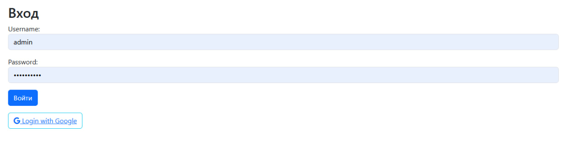
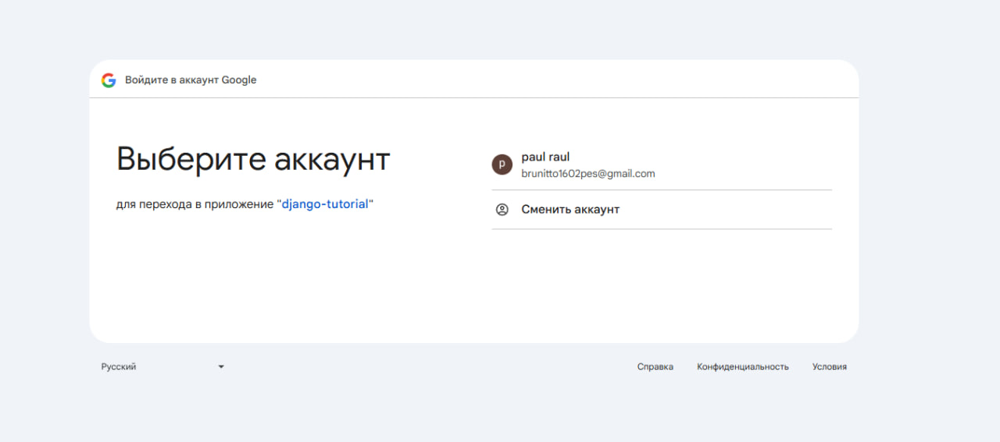
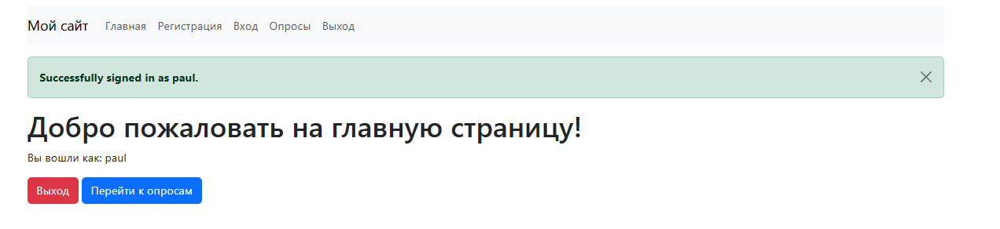

# Практическая работа - Настройка OAuth 2.0 авторизации в Django приложении (Django + OAuth + Google)

В рамках этой лабораторной работы мной была добавлена авторизация через Google в приложение из предыдущих ЛР

## Ход работы
Выполнив все шаги из туториала https://pylessons.com/django-google-oauth у меня получилось добавить авторизацию через Google в свое приложение 

